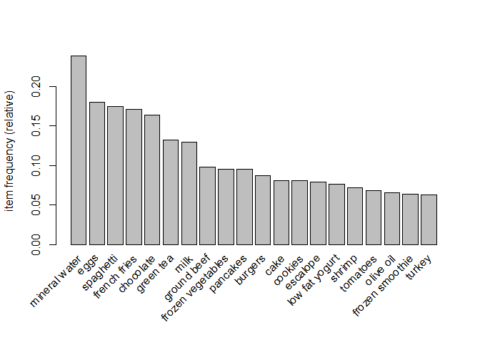
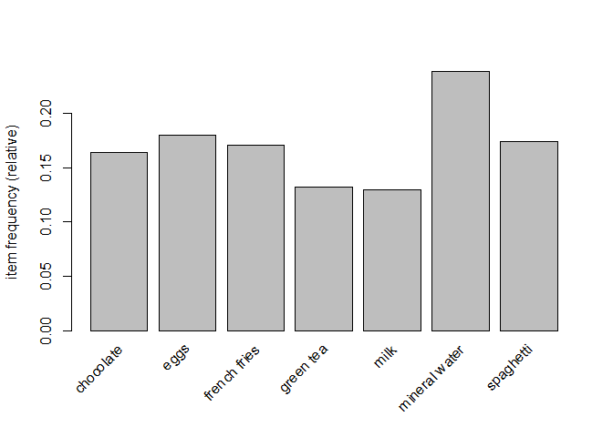
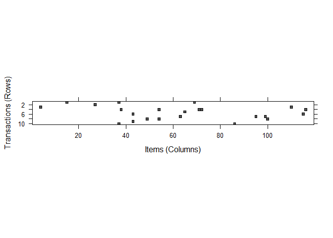
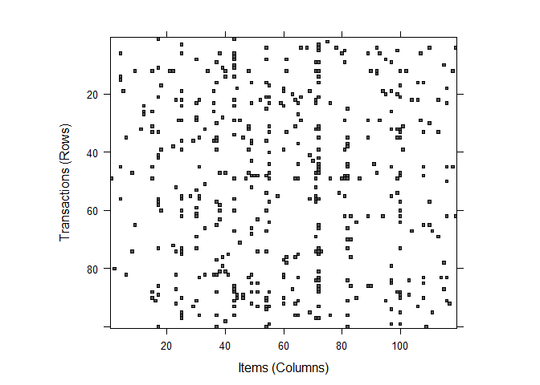

Association rules are the probability of relationships between data items, within large data sets in various types of databases. It shows that itemset's frequent in transactions. Most common example of association rules is market basket analysis.

## MARKET BASKET ANALYSIS

Market basket analysis examines the purchasing tendencies of the customers. In this analysis, the association rules of the products purchased by the customers is found, and the purchasing habits of the customers are determined in line with these association.

For instance, Let the example below be a transaction taken from the sales data of some supermarkets.

{onions , potatoes} → {burger}

If a customer buys onions and potatoes, we can say that the customer is likely to buy burger.

According to association rules itemsets always have sub items and left hand side of the rules is condition that we expected, right hand side of the rules is result of these condition.

Association rules are unsupervised machine learning types and that means we dont have to train and label data. All we need is apply appropriate algorihm to data and expect for it to make the correct classification.

## APRIORI

Most popular algorithm to analyse market basket data is apriori. 
According to apriori frequent items in transactions should also be frequent in sub transaction.

There are 3 important paremeters in apriori algorithm:
* Support
* Confidence
* Lift

Support refers to the default popularity of an item and can be calculated by finding number of transactions containing a particular item divided by total number of transactions.

Confidence refers to the likelihood that an item B is also bought if item A is bought. It can be calculated by finding the number of transactions where A and B are bought together, divided by total number of transactions where A is bought.

Lift(A -> B) refers to the increase in the ratio of sale of B when A is sold. Lift(A –> B) can be calculated by dividing Confidence(A -> B) divided by Support(B).


The market basket data used in this project contains information about customers buying different grocery items at a mall. Lets examine market basket data deeply.


```r
summary(MarketBasket)
```

```
## transactions as itemMatrix in sparse format with
##  7500 rows (elements/itemsets/transactions) and
##  119 columns (items) and a density of 0.03287171 
## 
## most frequent items:
## mineral water          eggs     spaghetti  french fries     chocolate 
##          1787          1348          1306          1282          1229 
##       (Other) 
##         22386 
## 
## element (itemset/transaction) length distribution:
## sizes
##    1    2    3    4    5    6    7    8    9   10   11   12   13   14   15   16 
## 1754 1358 1044  816  667  493  391  324  259  139  102   67   40   22   17    4 
##   18   19 
##    1    2 
## 
##    Min. 1st Qu.  Median    Mean 3rd Qu.    Max. 
##   1.000   2.000   3.000   3.912   5.000  19.000 
## 
## includes extended item information - examples:
##              labels
## 1           almonds
## 2 antioxydant juice
## 3         asparagus
```

* When we examine the data set with the Summary command;

* It shows the number of 7500 transactions, 119 different products. The value of density (3.2%) refers to the proportion of non-zero matrix cells.

* Since there are 7500 * 119 = 892,500 positions in the matrix, we can calculate that a total of 892,500 * 0.03287171 = 29,338 items were purchased in the store.

* Most frequent items show the most frequently purchased items. With 1787/7500 = 0.23, we can say that 23% of the shopping contains mineral water.

* The element section contains the statistics of how many items are included in each purchase. There are 1 product in 1754 shopping, 2 product in 1358 shopping, 1044 product in 1044 shopping.

* On average, there are 4 products in one shop.


```r
inspect(MarketBasket[1:5])
```

```
##     items             
## [1] {burgers,         
##      eggs,            
##      meatballs}       
## [2] {chutney}         
## [3] {avocado,         
##      turkey}          
## [4] {energy bar,      
##      green tea,       
##      milk,            
##      mineral water,   
##      whole wheat rice}
## [5] {low fat yogurt}
```

```r
itemFrequency(MarketBasket[,1:3])
```

```
##           almonds antioxydant juice         asparagus 
##        0.02026667        0.00880000        0.00480000
```
With the Inspect command, each transaction can be examined separately. The first five transactions are as above.

The ItemFrequency command allows us to calculate the transaction rate for each product. 


```r
itemFrequencyPlot(MarketBasket, topN = 20)
```

<!-- -->

The chart shows the 20 most purchased items.


```r
itemFrequencyPlot(MarketBasket, support = .1)
```

<!-- -->

In this chart, products with at least 10% support rate are shown.


```r
par(mfrow=c(2,2))
image(MarketBasket[1:10])
```

<!-- -->

```r
image(sample(MarketBasket,100))
```

<!-- -->

The first graphic shows the first 10 transactions and their distribution among 119 products. The other shows 100 randomly selected transactions and their distribution in 119 products. These charts allow us to examine the data more closely and can help identify potential data problems.

For example, fully filled columns may show items purchased in each transaction, or sparse columns may show data that was mistakenly included in the transaction dataset.


```r
MarketBasketRules <- apriori(MarketBasket, parameter = list(supp = 0.008, conf = 0.25, minlen = 2))
```

```
## Apriori
## 
## Parameter specification:
##  confidence minval smax arem  aval originalSupport maxtime support minlen
##        0.25    0.1    1 none FALSE            TRUE       5   0.008      2
##  maxlen target  ext
##      10  rules TRUE
## 
## Algorithmic control:
##  filter tree heap memopt load sort verbose
##     0.1 TRUE TRUE  FALSE TRUE    2    TRUE
## 
## Absolute minimum support count: 60 
## 
## set item appearances ...[0 item(s)] done [0.00s].
## set transactions ...[119 item(s), 7500 transaction(s)] done [0.01s].
## sorting and recoding items ... [88 item(s)] done [0.00s].
## creating transaction tree ... done [0.00s].
## checking subsets of size 1 2 3 4 done [0.00s].
## writing ... [153 rule(s)] done [0.00s].
## creating S4 object  ... done [0.00s].
```
In this step, we created the apriori algorithm.

When deciding on the support value, if we consider the situation where each item is purchased twice a day, we can assume that there are approximately 60 transactions within a month.
If we calculate the support value of 60 repetitions in 7500 transactions, we reach 60/7500 = 0.008. For this reason, we can first try the value of 0.008 as a support value.

0.25 confidence indicates that the rule must be at least 25 percent correct to be included in the results.

On the other hand, Minlen prevents transactions that contain less than 2 products from circumventing the rule and creating meaningless rules. As a result of these parameters, the algorithm has created 153 rules.


```r
summary(MarketBasketRules)
```

```
## set of 153 rules
## 
## rule length distribution (lhs + rhs):sizes
##  2  3 
## 70 83 
## 
##    Min. 1st Qu.  Median    Mean 3rd Qu.    Max. 
##   2.000   2.000   3.000   2.542   3.000   3.000 
## 
## summary of quality measures:
##     support          confidence        coverage            lift      
##  Min.   :0.00800   Min.   :0.2507   Min.   :0.01520   Min.   :1.174  
##  1st Qu.:0.00920   1st Qu.:0.2834   1st Qu.:0.02760   1st Qu.:1.535  
##  Median :0.01107   Median :0.3176   Median :0.03547   Median :1.732  
##  Mean   :0.01508   Mean   :0.3388   Mean   :0.04649   Mean   :1.824  
##  3rd Qu.:0.01693   3rd Qu.:0.3825   3rd Qu.:0.05240   3rd Qu.:2.004  
##  Max.   :0.05973   Max.   :0.5614   Max.   :0.23827   Max.   :4.130  
##      count      
##  Min.   : 60.0  
##  1st Qu.: 69.0  
##  Median : 83.0  
##  Mean   :113.1  
##  3rd Qu.:127.0  
##  Max.   :448.0  
## 
## mining info:
##          data ntransactions support confidence
##  MarketBasket          7500   0.008       0.25
```

Rule length distribution section shows how many rules there are in transactions with 2 and 3 items. We can say that 70 of 153 rules are transactions with 2, 83 of which contain 3 products.

In the Summary of quality measures section, we see the summary statistics table of each parameter. The fact that the support and confidence values are close to the minimum value may indicate that we set the parameter values too high. However, when we examine the table, we see that there are rules with high values. Therefore, we can say that the values we have determined are appropriate. A high lift value is a strong indicator that a rule is important and reflects a true link between items.


```r
inspect(MarketBasketRules[1:3])
```

```
##     lhs              rhs             support     confidence coverage   lift    
## [1] {french wine} => {mineral water} 0.008266667 0.3668639  0.02253333 1.539720
## [2] {fresh tuna}  => {mineral water} 0.008800000 0.3952096  0.02226667 1.658686
## [3] {pepper}      => {spaghetti}     0.009866667 0.3718593  0.02653333 2.135486
##     count
## [1] 62   
## [2] 66   
## [3] 74
```

We can examine the rules with the inspect command. For example, according to the first 3 rules, if a customer buys french wine, they will also buy mineral water and this rule is correct for 0.8% transaction and 36% of purchases include french wine. The lift value indicates how likely a customer buying French wine is to buy mineral water than an average customer.

We can divide the rules obtained in association analysis into 3 classes:

* Actionable
* Pointless
* Inexplicable

The general purpose in market basket analysis is to obtain actionable rules. When the above example is examined, we can say that the relationship between wine and mineral water is pointless. We will need to make some improvements to the performance of the model in order to achieve actionable rules.


```r
inspect(sort(MarketBasketRules, by = "lift")[1:5])
```

```
##     lhs                                rhs           support     confidence
## [1] {whole wheat pasta}             => {olive oil}   0.008000000 0.2714932 
## [2] {herb & pepper}                 => {ground beef} 0.016000000 0.3234501 
## [3] {frozen vegetables,spaghetti}   => {ground beef} 0.008666667 0.3110048 
## [4] {frozen vegetables,ground beef} => {spaghetti}   0.008666667 0.5118110 
## [5] {mineral water,spaghetti}       => {ground beef} 0.017066667 0.2857143 
##     coverage   lift     count
## [1] 0.02946667 4.130221  60  
## [2] 0.04946667 3.291555 120  
## [3] 0.02786667 3.164906  65  
## [4] 0.01693333 2.939190  65  
## [5] 0.05973333 2.907540 128
```

When we sort the rules according to lift values with the Sort command, it shows that a customer who buys whole wheat pasta with approximately 4.13 lift value for the first rule is 4.13 times more likely to buy olive oil compared to an average customer. In this way, we get actionable rules.


```r
oliveoil <- subset(MarketBasketRules, items %in% "olive oil")
inspect(oliveoil)
```

```
##      lhs                          rhs             support     confidence
## [1]  {whole wheat pasta}       => {olive oil}     0.008000000 0.2714932 
## [2]  {olive oil}               => {milk}          0.017066667 0.2596349 
## [3]  {olive oil}               => {spaghetti}     0.022933333 0.3488844 
## [4]  {olive oil}               => {mineral water} 0.027466667 0.4178499 
## [5]  {milk,olive oil}          => {mineral water} 0.008533333 0.5000000 
## [6]  {mineral water,olive oil} => {milk}          0.008533333 0.3106796 
## [7]  {chocolate,olive oil}     => {mineral water} 0.008266667 0.5040650 
## [8]  {mineral water,olive oil} => {chocolate}     0.008266667 0.3009709 
## [9]  {olive oil,spaghetti}     => {mineral water} 0.010266667 0.4476744 
## [10] {mineral water,olive oil} => {spaghetti}     0.010266667 0.3737864 
##      coverage   lift     count
## [1]  0.02946667 4.130221  60  
## [2]  0.06573333 2.003356 128  
## [3]  0.06573333 2.003547 172  
## [4]  0.06573333 1.753707 206  
## [5]  0.01706667 2.098489  64  
## [6]  0.02746667 2.397219  64  
## [7]  0.01640000 2.115550  62  
## [8]  0.02746667 1.836681  62  
## [9]  0.02293333 1.878880  77  
## [10] 0.02746667 2.146553  77
```

With the subset command, we can examine the rules that contain a specific product. If we examine the olive oil, which we see in the other table, has a high lift value. We can say that it has significant lift values with milk and spaghetti as well as whole wheat pasta.

## ECLAT

* The name of the Eclat algorithm comes from the combination of the words Equivalence Class Transformation.

* It is a more efficient and scalable version of the Apriori algorithm.

* While the Apriori algorithm works in a horizontal sense imitating the Breadth-First Search of a graph, the ECLAT algorithm works in a vertical manner just like the Depth-First Search of a graph. This vertical approach of the ECLAT algorithm makes it a faster algorithm than the Apriori algorithm.


```r
eclatrules <- eclat(MarketBasket, parameter = list(support = 0.008, minlen = 2))
```

```
## Eclat
## 
## parameter specification:
##  tidLists support minlen maxlen            target  ext
##     FALSE   0.008      2     10 frequent itemsets TRUE
## 
## algorithmic control:
##  sparse sort verbose
##       7   -2    TRUE
## 
## Absolute minimum support count: 60 
## 
## create itemset ... 
## set transactions ...[119 item(s), 7500 transaction(s)] done [0.00s].
## sorting and recoding items ... [88 item(s)] done [0.00s].
## creating sparse bit matrix ... [88 row(s), 7500 column(s)] done [0.00s].
## writing  ... [271 set(s)] done [0.02s].
## Creating S4 object  ... done [0.00s].
```

```r
summary(eclatrules)
```

```
## set of 271 itemsets
## 
## most frequent items:
## mineral water     spaghetti     chocolate          eggs          milk 
##            66            55            45            39            39 
##       (Other) 
##           339 
## 
## element (itemset/transaction) length distribution:sizes
##   2   3 
## 230  41 
## 
##    Min. 1st Qu.  Median    Mean 3rd Qu.    Max. 
##   2.000   2.000   2.000   2.151   2.000   3.000 
## 
## summary of quality measures:
##     support         transIdenticalToItemsets     count      
##  Min.   :0.008000   Min.   : 60.0            Min.   : 60.0  
##  1st Qu.:0.009333   1st Qu.: 70.0            1st Qu.: 70.0  
##  Median :0.011867   Median : 89.0            Median : 89.0  
##  Mean   :0.014987   Mean   :112.4            Mean   :112.4  
##  3rd Qu.:0.017067   3rd Qu.:128.0            3rd Qu.:128.0  
##  Max.   :0.059733   Max.   :448.0            Max.   :448.0  
## 
## includes transaction ID lists: FALSE 
## 
## mining info:
##          data ntransactions support
##  MarketBasket          7500   0.008
```

Unlike the Apriori algorithm, it only works with the support parameter. When we applied the same support value, the algorithm created 271 rules.


```r
inspect(sort(eclatrules, by ="support")[1:5])
```

```
##     items                       support    transIdenticalToItemsets count
## [1] {mineral water,spaghetti}   0.05973333 448                      448  
## [2] {chocolate,mineral water}   0.05266667 395                      395  
## [3] {eggs,mineral water}        0.05093333 382                      382  
## [4] {milk,mineral water}        0.04800000 360                      360  
## [5] {ground beef,mineral water} 0.04093333 307                      307
```

```r
oliveoil2 <- subset(eclatrules, items %in% "olive oil")
inspect(oliveoil2)
```

```
##      items                               support     transIdenticalToItemsets
## [1]  {olive oil,whole wheat pasta}       0.008000000  60                     
## [2]  {olive oil,soup}                    0.008933333  67                     
## [3]  {milk,mineral water,olive oil}      0.008533333  64                     
## [4]  {chocolate,mineral water,olive oil} 0.008266667  62                     
## [5]  {mineral water,olive oil,spaghetti} 0.010266667  77                     
## [6]  {mineral water,olive oil}           0.027466667 206                     
## [7]  {olive oil,spaghetti}               0.022933333 172                     
## [8]  {eggs,olive oil}                    0.012000000  90                     
## [9]  {chocolate,olive oil}               0.016400000 123                     
## [10] {french fries,olive oil}            0.009200000  69                     
## [11] {milk,olive oil}                    0.017066667 128                     
## [12] {green tea,olive oil}               0.009866667  74                     
## [13] {ground beef,olive oil}             0.014133333 106                     
## [14] {frozen vegetables,olive oil}       0.011333333  85                     
## [15] {olive oil,pancakes}                0.010800000  81                     
## [16] {olive oil,shrimp}                  0.008000000  60                     
##      count
## [1]   60  
## [2]   67  
## [3]   64  
## [4]   62  
## [5]   77  
## [6]  206  
## [7]  172  
## [8]   90  
## [9]  123  
## [10]  69  
## [11] 128  
## [12]  74  
## [13] 106  
## [14]  85  
## [15]  81  
## [16]  60
```
When sorting according to the support values with the Sort command, results close to the apriori ranking were obtained. Likewise, if we examine the olive oil product specifically, 16 meaningful and actionable rules are listed.

## REFERENCES

* Karthik Ramasubramanian , Abhishek Singh Machine Learning Using R
* Bernard Marr Artificial Intelligence in Practice How 50 Successful Companies Used AI
* https://www.geeksforgeeks.org/ml eclat algorithm/
* https://www.kaggle.com/devchauhan1/market basket optimisationcsv
* https://www.veribilimiokulu.com/associationrulesanalysis/

